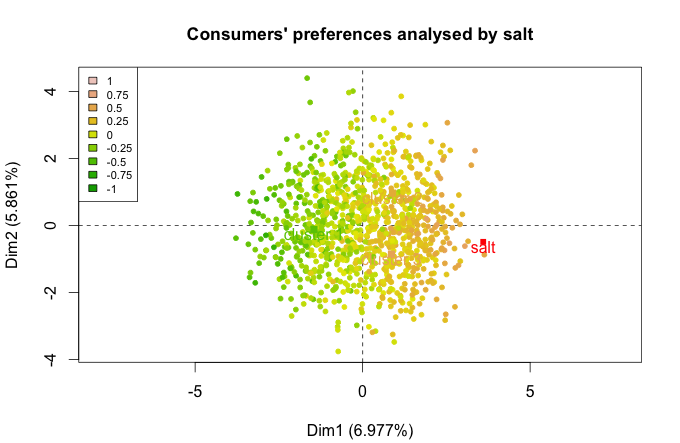

# Understanding the data from a consumer perspective
## Playing with R and the data

In this part, the analyses are not going to be too complicated, but you will see that data manipulation and visualization is not simple when you deal with categorical variables.
Please install and load the two following packages.

```{r, eval=FALSE}
install.packages("questionr")
install.packages("dataMaid")
```

```{r}
library(questionr)
library(dataMaid)
```

**Exercise. **Comment on the different ways of describing the data.

```{r, echo=FALSE}
salmon_hedo_conso <- read.delim2("salmon_hedo_conso.txt", header=TRUE, row.names=1, comment.char="#",dec=",",stringsAsFactors=TRUE)
library(FactoMineR)
```


```{r, eval=FALSE}
summary(salmon_hedo_conso)
str(salmon_hedo_conso)
describe(salmon_hedo_conso)
describe(salmon_hedo_conso[,32:40])
```

In the following part, we're going to change the names of the variables as well as their labels, to change the order of the levels of a given factor of interest as well as their value ; finally, we're going to plot a categorical variable, in a simple way and in a more complicated way.

```{r}
#Manipulating data
#Names of the variables
colnames(salmon_hedo_conso)
colnames(salmon_hedo_conso)[62] <- "Bread, butter"
colnames(salmon_hedo_conso)[63] <- "Lemon, bread, butter"
colnames(salmon_hedo_conso)[64] <- "Crême fraîche"
colnames(salmon_hedo_conso)[65] <- "Crême fraîche with herbs"
colnames(salmon_hedo_conso)[66] <- "Fresh cheese"
colnames(salmon_hedo_conso)[100] <- "Not too salty"
colnames(salmon_hedo_conso)

#Labels of the variables
library(labelled)
str(salmon_hedo_conso$Pleasure)
var_label(salmon_hedo_conso$Pleasure) <- "I eat smoked salmon because it is a product which gives me pleasure"
var_label(salmon_hedo_conso$Pleasure)
str(salmon_hedo_conso$Pleasure)
```

```{r}
#Changing the order of the levels
#Before
levels(salmon_hedo_conso$Pleasure)
describe(salmon_hedo_conso$Pleasure)
#plot(salmon_hedo_conso$Pleasure)

#After
salmon_hedo_conso$Pleasure <- factor(salmon_hedo_conso$Pleasure, levels=c("Comp. Disa.","Most. Disa.","Neither", "Most. Agree","Comp. Agree"))
levels(salmon_hedo_conso$Pleasure)
describe(salmon_hedo_conso$Pleasure)
#plot(salmon_hedo_conso$Pleasure)
```

You may also want to use this interactive alternative.

```{r, eval=FALSE}
iorder(salmon_hedo_conso,"Who")
```

Now, let's have a look at some graphical representation.

```{r}
#Graphical representation (level 1)
salmon_hedo_conso$Country[1:100]
#plot(salmon_hedo_conso$Country)
```

**Exercise. **Please, comment on this alternative.

```{r,eval=FALSE}
#table uses the cross-classifying factors to build a contingency table of the counts at each combination of factor levels
bp <- table(salmon_hedo_conso$Country) 
bp
barplot(bp)
bp <- sort(bp,decreasing = F)
bp
barplot(bp)
```

**Exercise. **Please, run the following code.
```{r,eval=FALSE}
#When crossing two variables
plot(saumon_hedo_conso$"Bread, butter")
plot(saumon_hedo_conso$"Bread, butter",saumon_hedo_conso$prod2)
```

Now, let's have a look at a more professional graphical output.

```{r}
#Graphical representation (level 2)
bp <- table(salmon_hedo_conso$Country) 
bp <- sort(bp,decreasing = F)
#Step 1
par(omi=c(0.65,0.25,0.75,0.75) ,mai=c(0.3,2,0.35,0) ,mgp=c(3,3,0), las=1)
x <- barplot(bp,names.arg=F,horiz=T,border=NA,xlim=c(0,120), col="grey", cex.names=0.85,axes=F)
for (i in 1:length(bp))
{
  text(-18,x[i],names(bp)[i],xpd=T,adj=1,cex=0.85) 
  text(-3.5,x[i],bp[i],xpd=T,adj=1,cex=0.85) 
}
rect(0,-0.5,20,28,col=rgb(191,239,255,80, maxColorValue=255), border=NA)
rect(20,-0.5,40,28,col=rgb(191,239,255,120, maxColorValue=255), border=NA)
rect(40,-0.5,60,28,col=rgb(191,239,255,80,maxColorValue=255), border=NA)
rect(60,-0.5,80,28,col=rgb(191,239,255,120, maxColorValue=255), border=NA)
rect(80,-0.5,100,28, col=rgb(191,239,255,80, maxColorValue =255), border=NA)
rect(100,-0.5,120,28, col=rgb(191,239,255,80, maxColorValue =255), border=NA)

myValue2<-c(0,0,73,0,0,0,0,0,113,0,0)
myColour2 <-rgb(255,0,210, maxColorValue =255)
x2<- barplot(myValue2,names.arg=F,horiz=T,border=NA,xlim=c(0,120),col=myColour2,cex.names=0.85,axes=F,add=T)

#Step 2
m <- mean(bp) #The mean function
arrows(m,-0.5,m,14, lwd=1.5,length=0,xpd=T,col="skyblue3")
arrows(m,-0.5,m,-0.75,lwd=3,length=0,xpd=T)
arrows(m,14,m,14.25, lwd=3,length=0,xpd=T) 
text(m-18,14.5,"Average",adj=1,xpd=T,cex=0.65,font=3) 
text(m-3,14.5,"96.5",adj=1,xpd=T,cex=0.65,font=4) 

#Step 3
mtext(c(0,20,40,60,80,100) ,at=c(0,20,40,60,80,100),1,line=0,cex=0.80)
mtext("European survey on consumers habits",3,line=1.3,adj=0,cex=1.1,outer=T)
mtext("European project EUROSALMON",3,line=-0.4,adj=0,cex=0.9,outer=T) 
mtext("MATRA - IFREMER - ADRIANT",1,line=1,adj=1.0,cex=0.65,outer=T,font=3)
```

## Understanding the consumers' behaviour
In this part, we're going to play with the questionnaire data. These data are categorical, and you have to use a specific method for these particular data: Multiple Correspondence Analysis (MCA).

```{r}
colnames(salmon_hedo_conso)
res.mca <- MCA(salmon_hedo_conso[,33:100],graph=F)
plot.MCA(res.mca,choix="ind",invisible = "var",label="none",graph.type = "classic")
plot.MCA(res.mca,choix="ind",invisible = "ind")
plot.MCA(res.mca,choix="ind",invisible = "ind",selectMod="cos2 10")
```

**Exercise. **Let's spend some time on these outputs and on the theory behind MCA.

Now, let's run **MCA** again with some particular inputs. But before that, let's have a look at the variance associated with our dimensions.

```{r}
res.mca$eig
```

In the following code, we store the results from the 50 first dimensions, and we get rid of the categories that are not chosen, according to a given threshold.

```{r}
res.mca <- MCA(salmon_hedo_conso[,c(2,33:100)],quali.sup=1,graph=F,ncp=50,level.ventil=0.05)
```

**Exercise. **Let's give some interpretation to the results.

```{r,eval=FALSE}
res.dim <- dimdesc(res.mca)
names(res.dim)
names(res.dim$`Dim 1`)
res.dim$`Dim 1`$"quali"
res.dim$`Dim 1`$"category"
res.dim$`Dim 2`$"category"
```

As we said previously, MCA as PCA will reduce the complexity of your data by extracting relevant dimensions. To reduce the complexity from an individual point of view, you have to cluster the individuals.

```{r}
res.hcpc <- HCPC(res.mca,nb.clust = 3)
```

**Exercise. **Let's give some interpretation to the results.

```{r,eval=FALSE}
round(res.hcpc$desc.var$category$`1`,2)
round(res.hcpc$desc.var$category$`2`,2)
round(res.hcpc$desc.var$category$`3`,2)
```

## Understanding the consumers' preferences

**Exercise. **You should be able to do that by yourself using PCA.

## Linking consumers' preferences and behaviour

To do so, we're going to import a new dataset.

```{r}
salmon_final <- read.delim2("saumon_final.txt", header=TRUE, row.names=1, comment.char="#",dec=",",stringsAsFactors=TRUE)
colnames(salmon_final)
summary(salmon_final)
salmon_final[1063:1078,1:33]
```

**Exercise. **Let's run the following code and comment.

```{r,eval=FALSE}
res_final <- PCA(salmon_final,ind.sup = 1063:1078,quali.sup=c(1,32:99),graph = F)
plot.PCA(res_final,choix="ind",invisible = c("ind","quali"))
plot.PCA(res_final,choix="var")

res.dim <- dimdesc(res_final)
res.dim$Dim.1$quanti
res.dim$Dim.1$quali

cluster_final <- HCPC(res_final)
cluster_final$desc.var$category$`1`
cluster_final$desc.var$category$`3`
```

Now, it's your turn to work and to interpret.

```{r salt, echo=FALSE, fig.align='center', fig.cap="Consumers according to the variable salt"}

```

